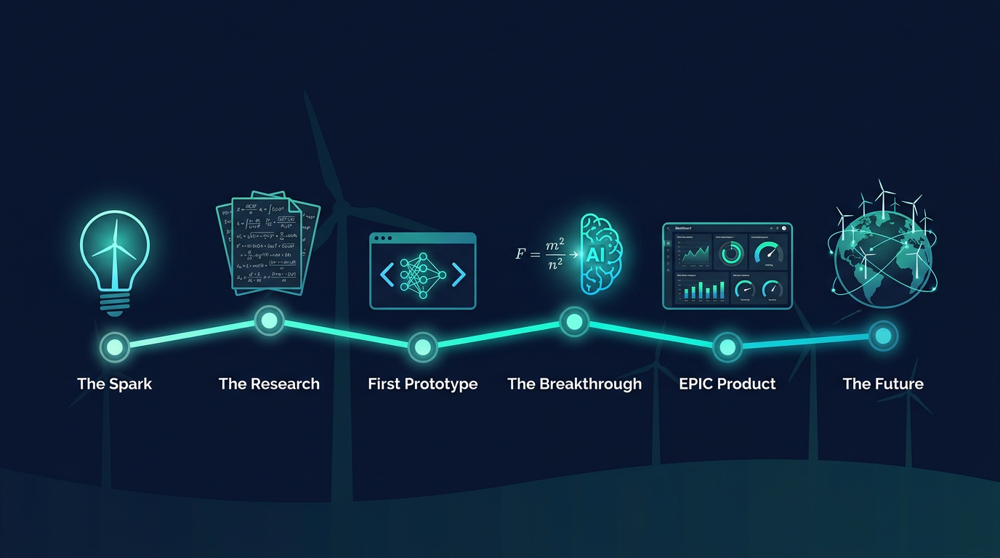

---
tags:
- predictive-maintenance
- wind-energy
- bayesian-neural-network
- scada-telemetry
- aerovigil-ai
- pytorch
- physics-informed
- remaining-useful-life
- rul-prediction
- drivetrain-diagnostics
license: mit
library_name: pytorch
pipeline_tag: other
---

# AeroVigil: a check-engine light for wind turbines

A Physics-Guided Bayesian Neural Network (PG-BNN) that predicts — about **45
days early** — when a turbine's main bearing is running out of life, with an
honest estimate of how certain it is.

[](LICENSE)
[](https://www.python.org/downloads/)
[](https://pytorch.org/)
[](https://aerovigil.abacusai.app)

> ### 📊 AeroVigil in numbers
>
> | | | | |
> | :---: | :---: | :---: | :---: |
> | **~45 days** | **94.2%** | **$150k–$300k** | **8 turbine OEMs** |
> | early warning | early-warning accuracy | cost per surprise failure avoided | fleet-ready specs library |
> | **100%** recall | **6 signals** | **No new sensors** | **Offline-first** |
> | no failures missed | standard SCADA inputs | works with what you have | runs without internet |
>
> *Demo numbers from a deterministic 500-asset synthetic campaign. Validate on real site data before operations depend on them.*


# 🧭 Physics-Guided AI Framework (v2 extension)

[](#-physics-guided-ai-framework-v2-extension)
[](#edge-deployment-guide)
[](#federated-learning-setup-guide)
[](#mathematical-formulations)

The repository now ships a full **Physics-Guided AI framework** for wind-turbine
predictive maintenance, layered on top of the original AeroVigil PG-BNN:
first-principles physics losses (aerodynamics, drivetrain, thermal), a
Bayes-by-Backprop BNN with decomposed uncertainty, a Fourier Neural Operator
(PINO) for wake fields, uncertainty-driven active learning, physics-grounded
SHAP explainability, federated fleet training, and ONNX/C++ edge deployment.

## Architecture overview

```
wind-turbine-pg-bnn/
├── main.py                     # Unified CLI: train | evaluate | export | active-sample | explain
├── configs/
│   └── default.yaml            # model / physics / training / active_learning / federated / deployment
├── src/
│   ├── physics/
│   │   ├── aerodynamics.py     # Cp(β,λ) via Heier, Betz limit, rotor power, Jensen wake, aero loss
│   │   ├── drivetrain.py       # Gearbox torque transfer, L10 bearing life, vibration energy, loss
│   │   ├── thermal.py          # Copper+iron losses, lumped thermal network, temperature ODE, loss
│   │   └── constraints.py      # (legacy) soft PG-BNN constraints
│   ├── models/
│   │   ├── bayesian_nn.py      # BayesianLinear (Bayes-by-Backprop), PG-BNN, combined loss
│   │   ├── pino_operator.py    # SpectralConv2d, FNO, PINO with Navier–Stokes residual
│   │   └── bnn.py / ...        # (legacy) original PG-BNN modules
│   ├── active_learning/
│   │   └── uncertainty_sampler.py  # MC-dropout epistemic sampling → JSON maintenance alerts
│   ├── explainability/
│   │   └── physics_shap.py     # SHAP attributions mapped to physics residuals / root causes
│   ├── federated/
│   │   └── fed_client.py       # Flower NumPyClient with physics-aware evaluation metrics
│   └── deployment/
│       ├── export_onnx.py      # ONNX export with mean + variance heads, validation
│       └── cpp_inference/      # C++17 ONNX Runtime engine (inference.h/.cpp, CMakeLists.txt)
├── docker/
│   ├── Dockerfile.cloud        # CUDA + PyTorch training image
│   ├── Dockerfile.edge         # ONNX-Runtime-only edge image
│   └── docker-compose.yml      # trainer + fed-server + tensorboard + edge
├── .devcontainer/
│   └── cuda/devcontainer.json  # VS Code devcontainer (CUDA + PyTorch)
└── tests/
    ├── test_physics_guided.py  # Betz bounds, torque conservation, thermal steady state, gradients
    └── test_models.py          # BNN shapes, OOD uncertainty growth, FNO shapes, ONNX validity
```

**Data flow:** SCADA features → PG-BNN (physics-regularised) → predictive mean
+ aleatoric/epistemic uncertainty → (a) active-learning alerts when epistemic
uncertainty spikes, (b) physics-SHAP root-cause reports, (c) ONNX export for
edge gateways. Fleet-wide, farms train locally and share only weights via
Flower federated rounds.

## Mathematical formulations

**Combined physics-guided objective**

```
L_total = L_NLL + β · KL[q(w) ‖ p(w)] + λ_physics · L_physics
```

- `L_NLL = ½ Σ [ log σ²(x) + (y − μ(x))² / σ²(x) ]` — heteroscedastic Gaussian
  negative log-likelihood; trains the **aleatoric** noise head `σ²(x)`.
- `KL[q(w)‖p(w)]` — closed-form KL between the factorised Gaussian posterior
  `q(w)=N(μ_w, σ_w²)` (with `σ_w = softplus(ρ)`) and the prior `N(0, σ_p²)`
  (Bayes-by-Backprop). **Epistemic** uncertainty = variance of MC predictions
  across weight samples.

**Aerodynamics (`src/physics/aerodynamics.py`)**

```
Cp(λ, β) = c₁ (c₂/λᵢ − c₃β − c₄) e^(−c₅/λᵢ) + c₆λ        (Heier)
1/λᵢ     = 1/(λ + 0.08β) − 0.035/(β³ + 1)
P        = ½ ρ π R² v³ · Cp,     0 ≤ Cp ≤ 16/27 (Betz limit)
Δv/v     = (1 − √(1 − Ct)) / (1 + k·x/R)²                 (Jensen wake)
```

`L_aero` penalises (i) deviation of predicted power from `½ρAv³Cp` and
(ii) any prediction exceeding the Betz-limited available power.

**Drivetrain (`src/physics/drivetrain.py`)**

```
T_hss  = η · T_rotor / n                                   (torque transfer)
L10h   = (10⁶ / 60N) · (C/P)^p,  p = 3 (ball) or 10/3 (roller)   (ISO 281)
E_vib  ∝ ½ m v_rms²                                        (vibration energy)
```

`L_drive` enforces torque transfer consistency, irreversible wear
(`dD/dt ≥ 0`), and vibration/wear coherence.

**Thermal (`src/physics/thermal.py`)**

```
Q       = m I² R + k_fe ω^1.6                              (copper + iron losses)
C dT/dt = Q − (T_w − T_cool)/R_th                          (lumped network ODE)
T_w,ss  = T_cool + R_th · Q                                (steady state)
```

`L_thermal` matches predictions to the steady-state solution, forbids
`T_w < T_cool` while heat is generated, and softly penalises insulation-limit
violations.

**PINO wake operator (`src/models/pino_operator.py`)** — FNO layers act in
Fourier space (`ŷ = F⁻¹(W · F(x))` on the lowest modes) and training adds a
simplified steady Navier–Stokes residual:

```
R(u) = u ∂u/∂x + v ∂u/∂y − ν ∇²u − f
```

## Connected operator workflow

Every advisory surface now uses the same deterministic evidence bridge. A SCADA
snapshot is evaluated by the PG-BNN and physics checks, then receives one MIKA +
KAI evidence brief before it reaches the API, command line, fleet CSV report,
or dashboard. The brief preserves the original model outputs and records its
source trail (`telemetry`, `pg_bnn`, physics constraints where available, and
the safety contract), so an operator sees the same advisory context regardless
of entry point. Digital-twin updates add their wear and ISO 281 evidence to the
same advisory-only evidence mesh.

The operational application can also attach an optional checkpoint produced by
the physics-guided framework: set `AV_PHYSICS_GUIDED_MODEL_PATH` to a
`main.py train` checkpoint. `POST /api/advisory` then returns a labelled
`physics_guided` posterior alongside the RUL advisory. It is intentionally not
relabelled as RUL unless the checkpoint was trained and validated for that
target. The adapter accepts measured wind/power in `physics_guided_context`; it
uses explicitly labelled load-based estimates for legacy five-signal clients.
The same checkpoint is passed into new digital-twin instances, retained in
state history, and included in live fleet reports. Use `python -m src physics
train ...` (or evaluate/export/active-sample/explain) to access framework
actions from the unified CLI.

## Installation

**Pip (local)**

```bash
git clone https://github.com/rajaram-2005/wind-turbine-pg-bnn.git
cd wind-turbine-pg-bnn
pip install -e ".[dev]"
pip install onnx onnxruntime shap flwr   # framework extras
```

**Docker**

```bash
docker build -f docker/Dockerfile.cloud -t pg-ai-cloud .   # cloud training (CUDA)
docker build -f docker/Dockerfile.edge  -t pg-ai-edge  .   # edge inference (ONNX only)
docker compose -f docker/docker-compose.yml up --build     # full stack
```

**VS Code devcontainer** — open the repo in VS Code → “Reopen in Container”
and pick **PG-AI CUDA + PyTorch** (`.devcontainer/cuda/`). The default
universal container remains available.

## Usage — unified CLI

```bash
# 1. Train the PG-BNN with the combined physics+data loss
python main.py train --config configs/default.yaml --epochs 100

# 2. Evaluate: RMSE, aleatoric/epistemic uncertainty, 95 % CI coverage
python main.py evaluate --checkpoint artifacts/pg_bnn.pt

# 3. Export to ONNX (mean + variance heads, validated vs PyTorch)
python main.py export --checkpoint artifacts/pg_bnn.pt --out artifacts/pg_bnn.onnx

# 4. Active learning: flag high-epistemic-uncertainty SCADA samples
python main.py active-sample --checkpoint artifacts/pg_bnn.pt --out artifacts/maintenance_alerts.json

# 5. Physics-grounded SHAP explanation report
python main.py explain --checkpoint artifacts/pg_bnn.pt --out artifacts/explain_report.json
```

## Configuration guide

All knobs live in `configs/default.yaml` (validated by
`src/utils/config.py`):

| Section | Key knobs | Purpose |
|---|---|---|
| `model` | `in_features`, `hidden_dims`, `dropout`, `prior_sigma`, `pino.*` | BNN & FNO architecture |
| `physics` | `lambda_aero`, `lambda_drive`, `lambda_thermal`, `air_density`, `rotor_radius`, `gear_ratio` | physics-loss weights & plant parameters |
| `training` | `lr`, `epochs`, `batch_size`, `beta_kl`, `num_mc_samples`, `predict_mc_samples` | optimiser & ELBO settings |
| `active_learning` | `uncertainty_threshold`, `sample_budget`, `use_mc_dropout` | query strategy |
| `federated` | `num_rounds`, `min_clients`, `server_address` | fleet training |
| `deployment` | `onnx_opset`, `onnx_path`, `quantize`, `edge.num_threads` | export & edge |

## API reference summary

| Module | Key symbols |
|---|---|
| `src.physics.aerodynamics` | `power_coefficient`, `rotor_mechanical_power`, `jensen_wake_deficit`, `aerodynamic_physics_loss`, `BETZ_LIMIT` |
| `src.physics.drivetrain` | `gearbox_torque_transfer`, `bearing_l10_life_hours`, `vibration_stress_energy`, `drivetrain_physics_loss` |
| `src.physics.thermal` | `generator_heat_dissipation`, `simulate_winding_temperature`, `thermal_physics_loss` |
| `src.models.bayesian_nn` | `BayesianLinear`, `PhysicsGuidedBNN` (`.predict()` → mean/aleatoric/epistemic/total std), `PGBNNLoss`, `train_step` |
| `src.models.pino_operator` | `SpectralConv2d`, `FourierNeuralOperator`, `PINO` (`.pde_residual()`, `.loss()`) |
| `src.active_learning` | `UncertaintySampler` (`.query()`, `.write_alert_log()`), `MaintenanceAlert` |
| `src.explainability` | `PhysicsSHAP` (`.explain()` → root cause ∈ {mechanical_wear, thermal_overheating, sensor_drift, aerodynamic_anomaly}) |
| `src.federated` | `FlowerFederatedClient`, `FederatedConfig`, `start_client` |
| `src.deployment` | `export_bnn_to_onnx`, `validate_onnx_export` |

## Federated learning setup guide

Raw SCADA never leaves a farm — only weights do.

```bash
# 1. Server (cloud) — or use the compose service `fed-server`
python -c "import flwr as fl; fl.server.start_server(
    server_address='0.0.0.0:8080',
    config=fl.server.ServerConfig(num_rounds=20))"
```

```python
# 2. Each farm (client)
from src.federated import FederatedConfig, FlowerFederatedClient, start_client
from src.models.bayesian_nn import PhysicsGuidedBNN

model = PhysicsGuidedBNN(in_features=6)
client = FlowerFederatedClient(
    model,
    train_data=(x_train, y_train),   # local SCADA tensors
    val_data=(x_val, y_val),
    config=FederatedConfig(server_address="fleet-server:8080"),
)
start_client(client)
```

Each client reports `physics_loss` in its evaluation metrics, so a custom
Flower strategy can perform **physics-aware aggregation** (down-weighting
updates that violate the shared turbine physics).

## Edge deployment guide

1. **Export:** `python main.py export --checkpoint artifacts/pg_bnn.pt`
   → `artifacts/pg_bnn.onnx` with `mean` and `variance` outputs (Bayesian
   layers fixed to posterior means; validated against PyTorch).
2. **Python edge:** `docker run -v $PWD/artifacts:/models pg-ai-edge`
   (ONNX Runtime only, no PyTorch).
3. **C++ edge:** build the static library in `src/deployment/cpp_inference/`:

```bash
cd src/deployment/cpp_inference
cmake -B build -DONNXRUNTIME_ROOT=/opt/onnxruntime
cmake --build build --config Release
```

```cpp
pgbnn::OnnxInferenceEngine engine("pg_bnn.onnx");
auto result = engine.Run({7.4f, 1.5f, 62.5f, 2.4f, 33.f, 810.f});
float mean = result.mean[0], std = std::sqrt(result.variance[0]);
```

## Contributing

See [CONTRIBUTING.md](CONTRIBUTING.md). In short: fork → feature branch →
`make lint test` → PR. New physics terms must ship with unit tests proving
bounds (e.g. Betz limit) and gradient flow; new model heads must keep the
uncertainty decomposition intact.

## License

MIT — see [LICENSE](LICENSE).

---


## What is this? (30-second read)

A wind turbine's main bearing spins **around one billion times** over its life.
When it fails with no warning, the operator suddenly needs a crane, a specialist
crew, and an emergency repair that can cost roughly **$150k–$300k per event**.

**AeroVigil turns everyday turbine telemetry into an early warning.** It tells
you *how much healthy life is left, how sure the model is, and whether you still
have time to schedule the repair* instead of reacting to a surprise failure.

| AeroVigil at a glance | |
|---|---|
| Early warning | ~45 days before failure |
| Inputs | 6 standard SCADA signals — no new sensors needed |
| Outputs | Days of life left, confidence range, risk level |
| Demo accuracy | 94.2% early-warning accuracy |
| Live demo | [aerovigil.abacusai.app](https://aerovigil.abacusai.app) |

### Three things to know

1. **It is physics-guided, not pure pattern-matching.** Predictions are checked
   against ISO 281 bearing-life logic, so answers stay physically sensible.
2. **It is honest about uncertainty.** You get a range and a risk level, not one
   overconfident number.
3. **It advises; it never controls.** AeroVigil helps humans plan maintenance.
   It does not send commands to the turbine.

> **New to the topic?** Read the zero-jargon [explainer](docs/EXPLAINER.md).
> **Pitching or evaluating?** Open the [investor one-pager](docs/PITCH.md).
> **Want the origin story?** Read [how AeroVigil came to be](docs/STORY.md).

## 💰 The business case

The wind industry spends **billions annually** on operations & maintenance. A single
surprise drivetrain failure can shut down a turbine for **weeks** — with repair
costs of **$150,000–$300,000** and lost generation on top.

| | Unplanned failure | With AeroVigil |
|---|---|---|
| **Detection** | At or after failure | ~45 days before failure |
| **Crane scheduling** | Emergency booking at premium | Planned slot at standard rates |
| **Parts logistics** | Expedited shipping, 2–3× cost | Normal procurement cycle |
| **Lost generation** | 2–6 weeks downtime | Scheduled during low-wind window |
| **Repair cost** | $150k–$300k+ | Estimated 40–60% reduction |
| **Safety risk** | Reactive, high-pressure | Planned, controlled intervention |

### Why the timing matters

> The difference between **4 days** and **45 days** of warning is not an accuracy
> metric — it is the difference between an *emergency rescue* and a *scheduled
> maintenance visit*. 45 days is enough time to book a crane, order parts, align
> the crew, and pick a low-wind window to minimize lost generation.

### What operators tell us they need

> *"We don't need another dashboard full of raw sensor charts. We need one clear
> answer: **which turbine needs attention soon enough that we can plan the repair
> instead of reacting to a failure?**"*

AeroVigil is built to be that answer.

### Estimated ROI per turbine per year

| Item | Value |
|------|-------|
| Average surprise-failure cost (industry) | $150,000 – $300,000 |
| Probability of ≥ 1 drivetrain event per turbine (annual) | ~3–5% |
| Expected annual loss avoided (per turbine) | **$4,500 – $15,000** |
| Fleet of 100 turbines | **$450k – $1.5M / year** |
| Fleet of 500 turbines | **$2.25M – $7.5M / year** |

*These are directional estimates based on published industry O&M cost data.
Actual savings depend on fleet age, site conditions, and maintenance practices.*

## 🏆 Competitive landscape

Most predictive-maintenance tools either fit pure ML curves to historical data
or rely on physics formulas alone. AeroVigil combines both — and adds the
uncertainty honesty that operators actually need for high-consequence decisions.

| | Pure ML (LSTM, XGBoost) | Physics-only (ISO 281) | Traditional CMS alarms | **AeroVigil PG-BNN** |
|---|---|---|---|---|
| **Early warning** | Varies, no guaranteed horizon | Theoretical L10 only | Fixed thresholds, often too late | **~45 days, measured end-to-end** |
| **Uncertainty estimate** | ❌ No | ❌ No | ❌ No | **✅ Epistemic + aleatoric** |
| **Physics-grounded** | ❌ No | ✅ Yes | Partial | **✅ Yes (ISO 281 constraint)** |
| **Works on existing SCADA** | Needs large labeled dataset | Needs load history | Needs dedicated CMS sensors | **✅ 6 standard signals** |
| **Advisory-only safety** | Varies | N/A | Varies | **✅ Enforced in code** |
| **Runs offline** | Rarely | ✅ | Varies | **✅ Local weights** |
| **Demo accuracy** | ~80–88% MAE | N/A | Low recall, high false alarms | **94.2%, 100% recall** |

## 🌍 Market opportunity

The global wind O&M market is projected to reach **~$55 billion by 2030**,
driven by:

- **Aging fleets** — thousands of turbines entering the post-warranty period
- **Rising turbine sizes** — bigger machines = bigger repair bills
- **Offshore growth** — logistics cost per failure event is 3–5× onshore
- **Digitalization push** — operators investing in data-driven maintenance

AeroVigil targets the highest-cost failure node (drivetrain bearings) with a
product that is already **usable, deployable, and explainable** — not just a
research notebook.

**Supported turbine OEMs** out of the box: GE, Vestas, Siemens, Suzlon,
Gamesa, Nordex, Senvion, and the NREL 5MW reference — covering the majority
of the global installed fleet.

### ⏱️ Why now?

- **Thousands of turbines** installed in the 2010s are entering post-warranty
  life — exactly when surprise failures spike.
- **Offshore wind** is booming — but a single failure event at sea can cost
  **$500k+** and take months to repair.
- **Operators are data-ready** — SCADA systems already collect the signals
  AeroVigil needs. The gap is not data, it's *actionable intelligence*.
- **AI trust is the bottleneck** — black-box predictions are not trusted by
  the engineers who act on them. AeroVigil's physics guidance and uncertainty
  estimates are designed to close that trust gap.

## AeroVigilAI client applications

The product-facing application name is **AeroVigilAI**. Client experiences are
kept separate rather than forcing a browser layout onto desktop or field users:

| Client | Folder | Platforms | Connection |
|---|---|---|---|
| Browser operator console | [`app/`](app/) | Any modern browser | Same-origin `/api` service |
| Native operator app | [`apps/aerovigilai_flutter/`](apps/aerovigilai_flutter/) | Windows, macOS, iOS, Android | Localhost emulator aliases or an explicit LAN/deployment URL |

The native app’s README documents the correct backend address for Windows,
macOS, Android Emulator, iOS Simulator, and physical mobile devices. It uses a
wide desktop workspace on Windows/macOS and a compact mobile assessment flow on
iOS/Android.

## One connected application — dashboard + every API

AeroVigil now runs as **one project on one port**. The operator dashboard,
advisory engine, fleet reporting, digital twin, AeroZip telemetry, and raw PG-BNN
inference API all share the same process and deployment boundary. A lightweight,
separately deployable browser application is also available in [`app/`](app/):

```bash
pip install -e ".[api,demo]"
uvicorn src.unified_app:app --host 0.0.0.0 --port 8000

# Or run the standalone browser app (UI + /api on port 8080).
uvicorn app.server:app --host 0.0.0.0 --port 8080
```

Open <http://localhost:8000> for the dashboard, or <http://localhost:8080> for
the standalone web app. The connected service surfaces
are available without starting any other server:

| Surface | Path |
|---|---|
| Operator dashboard | `/` |
| Unified health/discovery | `/health` |
| Advisory, fleet, twin, telemetry, reports | `/api` (`/api/docs`) |
| Low-level PG-BNN prediction | `/model-api` (`/model-api/docs`) |

### Attach the physics-guided framework

The operations application can load a checkpoint emitted by `main.py train` and
carry its posterior through the API, dashboard, digital twin, and live fleet
reporting. It augments the operational RUL advisory; it is **not** silently
interpreted as RUL unless that checkpoint was explicitly trained and validated
for RUL.

```bash
# Train a framework checkpoint, then start the single-port application.
python main.py train --config configs/default.yaml --checkpoint artifacts/pg_bnn.pt
export AV_PHYSICS_GUIDED_MODEL_PATH=artifacts/pg_bnn.pt
uvicorn src.unified_app:app --host 0.0.0.0 --port 8000
```

`POST /api/advisory` accepts an optional `physics_guided_context` object. Supply
measured `wind_speed_ms` and `power_output_kw` whenever available. The adapter
otherwise derives labelled, load-based estimates to preserve compatibility with
existing five-signal clients. It also accepts optional `gearbox_ratio` and
`rated_power_kw` overrides.

```json
{
  "physics_guided_context": {
    "wind_speed_ms": 9.8,
    "power_output_kw": 1450,
    "gearbox_ratio": 91,
    "rated_power_kw": 2300
  }
}
```

The response adds `physics_guided.target_mean`, decomposed uncertainty, feature
provenance, and an advisory-only interpretation. The dashboard’s Prediction
Stats, digital-twin state history, and Markdown/text fleet reports display the
same supplementary evidence when the environment variable is configured.

Or run the complete container with `docker compose up aerovigil`; dashboard and
APIs are all exposed on port 8000. The old standalone launch commands remain
available only for backwards compatibility.

The command line is unified the same way — one tool for every operator and
framework task:

```bash
python -m src advisory examples/payload.json
python -m src fleet examples/fleet.csv -o fleet_report.md
python -m src twin status  --asset-id WTG-042 --model Vestas-V90
python -m src twin simulate --profile overload --hours 12 -o sim.json
python -m src twin prompt  --asset-id WTG-042

# Physics-guided framework commands through the same entry point.
python -m src physics train --config configs/default.yaml --epochs 100
python -m src physics evaluate --checkpoint artifacts/pg_bnn.pt
python -m src physics active-sample --checkpoint artifacts/pg_bnn.pt
python -m src physics explain --checkpoint artifacts/pg_bnn.pt
```

## Try it right now — offline demo in 2 commands

[](docs/assets/aerovigil-demo.mp4)

```bash
python scripts/train_pg_demo.py   # trains a small demo model (a few minutes)
python gradio_app/app.py          # opens the demo UI in your browser
```

The app prefers local weights from `artifacts/pg_bnn_demo/`, so the demo still
works with **no internet** after the training step.

- Full narrated demo video: [`docs/assets/aerovigil-demo.mp4`](docs/assets/aerovigil-demo.mp4)
- 60-second live-dashboard walkthrough: [`docs/assets/aerovigil-live-dashboard-60s.mp4`](docs/assets/aerovigil-live-dashboard-60s.mp4)
  (rebuild with `python scripts/build_live_dashboard_video.py`)
- Demo script and fallback plan: [`docs/DEMO_RUNBOOK.md`](docs/DEMO_RUNBOOK.md)

## How to run the application — step by step

This section walks you through running AeroVigil on **Windows**, **macOS**,
**Ubuntu**, and **other Linux** distributions. Choose your operating system
below.

> **Prerequisites for every platform:** you need **Python 3.9 or newer** and
> **Git** installed. If you already have both, skip to
> [Step 2: Clone the repository](#step-2-clone-the-repository).

---

### Step 1: Install Python and Git

<details open>
<summary><strong>🪟 Windows</strong></summary>

#### 1a. Install Python

1. Go to [python.org/downloads](https://www.python.org/downloads/) and download
   the latest **Python 3.11** (or 3.10 / 3.12) installer.
2. Run the installer. **Check the box "Add python.exe to PATH"** at the bottom
   of the first screen — this is critical.
3. Click **Install Now** and wait for completion.
4. Verify in **Command Prompt** (`Win + R` → type `cmd` → Enter):

   ```cmd
   python --version
   pip --version
   ```

   You should see `Python 3.11.x` (or similar) and a pip version. If you get
   "not recognized", restart your terminal or re-run the installer with the PATH
   box checked.

#### 1b. Install Git

1. Go to [git-scm.com/download/win](https://git-scm.com/download/win). The
   download should start automatically.
2. Run the installer with default settings (click **Next** through each screen).
3. Verify in **Command Prompt** or **PowerShell**:

   ```cmd
   git --version
   ```

> **Tip:** We recommend using **PowerShell** or **Windows Terminal** for the
> best experience.

</details>

<details>
<summary><strong>🍎 macOS</strong></summary>

#### 1a. Install Python

**Option A — Official installer (recommended for beginners):**

1. Go to [python.org/downloads](https://www.python.org/downloads/) and download
   the latest **Python 3.11** macOS installer (universal2).
2. Open the `.pkg` file and follow the installer prompts.
3. Verify in **Terminal** (`Cmd + Space` → type `Terminal`):

   ```bash
   python3 --version
   pip3 --version
   ```

**Option B — Homebrew (recommended for developers):**

1. Install Homebrew if you don't have it (paste in Terminal):

   ```bash
   /bin/bash -c "$(curl -fsSL https://raw.githubusercontent.com/Homebrew/install/HEAD/install.sh)"
   ```

2. Install Python:

   ```bash
   brew install python@3.11
   ```

3. Verify:

   ```bash
   python3 --version
   pip3 --version
   ```

#### 1b. Install Git

Git usually comes pre-installed on macOS. Verify:

```bash
git --version
```

If not installed, run:

```bash
# Via Xcode command-line tools (prompts a dialog):
xcode-select --install

# Or via Homebrew:
brew install git
```

</details>

<details>
<summary><strong>🐧 Ubuntu / Debian Linux</strong></summary>

#### 1a. Install Python

```bash
sudo apt update
sudo apt install -y python3 python3-pip python3-venv git
```

Verify:

```bash
python3 --version
pip3 --version
git --version
```

If you need a newer Python than your distro ships, use the
[deadsnakes PPA](https://launchpad.net/~deadsnakes/+archive/ubuntu/ppa):

```bash
sudo apt install -y software-properties-common
sudo add-apt-repository ppa:deadsnakes/ppa -y
sudo apt update
sudo apt install -y python3.11 python3.11-venv python3.11-dev
```

#### 1b. Install Git

Already installed with the `apt` command above. Verify:

```bash
git --version
```

</details>

<details>
<summary><strong>🐧 Fedora / RHEL / CentOS</strong></summary>

```bash
sudo dnf install -y python3 python3-pip git
```

Verify:

```bash
python3 --version
pip3 --version
git --version
```

</details>

<details>
<summary><strong>🐧 Arch Linux</strong></summary>

```bash
sudo pacman -S python python-pip git
```

Verify:

```bash
python --version
pip --version
git --version
```

</details>

---

### Step 2: Clone the repository

Open your terminal (Terminal on macOS/Linux, PowerShell or Command Prompt on
Windows) and run:

```bash
git clone https://github.com/rajaram-2005/wind-turbine-pg-bnn.git
cd wind-turbine-pg-bnn
```

---

### Step 3: Create a virtual environment

A virtual environment keeps this project's dependencies isolated from your other
Python projects.

**Windows (Command Prompt or PowerShell):**

```cmd
python -m venv .venv
.venv\Scripts\activate
```

**macOS / Linux (Terminal):**

```bash
python3 -m venv .venv
source .venv/bin/activate
```

After activation, your prompt will show `(.venv)` at the beginning. This means
the virtual environment is active. All `pip install` commands will now install
into this isolated environment.

> **Note:** You need to activate the virtual environment every time you open a
> new terminal window to work on this project.

---

### Step 4: Install dependencies

With the virtual environment activated:

```bash
# Install the core package
python -m pip install --upgrade pip
python -m pip install -e .

# Install the Gradio demo dependencies (for the interactive web UI)
python -m pip install -r gradio_app/requirements.txt

# (Optional) Install the REST API dependencies
python -m pip install -e ".[api]"

# (Optional) Install development dependencies (testing, linting)
python -m pip install -e ".[dev]"

# (Optional) Install everything at once
python -m pip install -e ".[all]"
```

---

### Step 5: Train the demo model

Generate the offline demo weights (takes a few minutes on CPU):

```bash
python scripts/train_pg_demo.py
```

This creates the following artifacts in `artifacts/pg_bnn_demo/`:

| File | Purpose |
|------|---------|
| `bnn_demo.pt` | Trained model weights |
| `config.json` | Model configuration |
| `scaler.npz` | Feature normalization parameters |

> The Gradio app uses these local weights by default, so the demo works
> **offline** after this step. If you skip training, the app falls back to
> the pre-trained demo weights bundled in `artifacts/pg_bnn_demo/`.

---

### Step 6: Run the application

You can run AeroVigil in several ways. Pick the one that fits your needs.

#### Option A: Gradio web UI (interactive demo)

This launches a browser-based interface where you can adjust turbine parameters
with sliders and see real-time predictions.

```bash
python gradio_app/app.py
```

Open your browser and go to **http://localhost:7860**. You will see:

- **Scenario presets** — pick Healthy / Warning / Critical
- **Manual sliders** — fine-tune 6 SCADA telemetry inputs
- **Gauge + histogram** — predicted remaining useful life with uncertainty
- **Risk badge** — color-coded risk level and maintenance recommendation

#### Option B: REST API (programmatic access)

Launch the FastAPI inference server:

```bash
# Make sure API dependencies are installed:
python -m pip install -e ".[api]"

# Start the server:
python -m aerovigil_pg_bnn.api
```

The server starts at **http://localhost:8000**. Interactive API docs are at
**http://localhost:8000/docs**.

Test with curl (Linux / macOS / Windows PowerShell):

```bash
curl -X POST "http://localhost:8000/predict?n_mcmc_samples=100" \
  -H "Content-Type: application/json" \
  -d '{
    "vibration_rms": 1.5,
    "bearing_temp": 45.0,
    "generator_temp": 60.0,
    "power_output": 2000.0,
    "wind_speed": 9.0,
    "operating_hours": 1000.0
  }'
```

On **Windows Command Prompt** (no `\` line continuation — use a single line):

```cmd
curl -X POST "http://localhost:8000/predict?n_mcmc_samples=100" -H "Content-Type: application/json" -d "{\"vibration_rms\": 1.5, \"bearing_temp\": 45.0, \"generator_temp\": 60.0, \"power_output\": 2000.0, \"wind_speed\": 9.0, \"operating_hours\": 1000.0}"
```

#### Option C: Python script (use the model directly)

```python
import torch
from aerovigil_pg_bnn import MonteCarloVI, PhysicsGuidedBNN

# Loads config.json and bnn_demo.pt from the bundled artifacts directory.
model = PhysicsGuidedBNN.from_pretrained("artifacts/pg_bnn_demo")

vi = MonteCarloVI(model, num_samples=100)
result = vi.predict_single([1.5, 45.0, 60.0, 2000.0, 9.0, 1000.0])
print(result)
```

`predict_single` returns the mean RUL, uncertainty, 95% interval, risk level,
and whether maintenance planning is recommended at the 45-day threshold.

#### Option D: CLI (command-line inference)

Save `telemetry.json`:

```json
{
  "vibration_rms": 1.5,
  "bearing_temp": 45.0,
  "generator_temp": 60.0,
  "power_output": 2000.0,
  "wind_speed": 9.0,
  "operating_hours": 1000.0
}
```

Then run:

```bash
aerovigil-infer --input telemetry.json --samples 100
```

#### Option E: Docker (any OS — no Python setup needed)

If you have [Docker Desktop](https://docs.docker.com/get-docker/) installed,
this is the simplest way to run AeroVigil on **any** platform:

```bash
# Run the REST API
docker compose up api

# Run the Gradio demo
docker compose up gradio

# Run both at the same time
docker compose up api gradio
```

- API: **http://localhost:8000**
- Gradio: **http://localhost:7860**

For GPU acceleration (NVIDIA GPU + Docker):

```bash
docker compose up api-gpu
```

---

### Troubleshooting

| Problem | Solution |
|---------|----------|
| `python` or `python3` not found | Make sure Python is installed and in your PATH (see Step 1). On Windows, try `py` instead of `python`. |
| `pip install` fails with permission error | Make sure your virtual environment is activated (prompt should show `(.venv)`). If not, use `python -m pip install` instead of bare `pip install`. |
| `ModuleNotFoundError: No module named 'torch'` | Install dependencies: `python -m pip install -e . && python -m pip install -r gradio_app/requirements.txt` |
| Port 7860 or 8000 already in use | Stop the other process, or change the port. For Gradio, edit `server_port` in `gradio_app/app.py`. For the API, set `PORT=9000` env variable. |
| Training is slow | This is normal on CPU — the demo training takes a few minutes. For faster training, install the GPU version of PyTorch from [pytorch.org](https://pytorch.org/get-started/locally/). |
| `venv` command not found (Linux) | Install the venv package: `sudo apt install python3-venv` (Ubuntu/Debian) or `sudo dnf install python3-venv` (Fedora). |
| `torch` install fails on Apple Silicon (M1/M2/M3) | Use the default PyTorch — it has native Apple Silicon support since PyTorch 2.0. If issues persist: `pip install --pre torch --extra-index-url https://download.pytorch.org/whl/nightly/cpu` |
| Gradio shows "Running on local URL" but browser doesn't open | Manually open http://localhost:7860 in your browser. |
| Windows: `'python' is not recognized` | Re-run the Python installer and check **"Add python.exe to PATH"**, or use the `py` launcher instead: `py -m venv .venv` |
| Windows: `.venv\Scripts\activate` doesn't work in PowerShell | You may need to allow script execution: `Set-ExecutionPolicy -ExecutionPolicy RemoteSigned -Scope CurrentUser` |

## What the answers look like

| Signal | Meaning |
|---|---|
| 🟢 45+ days of life left | Healthy — keep monitoring |
| 🟡 14–45 days | Schedule maintenance |
| 🔴 under 14 days | Urgent — act now |

The model also reports how certain it is. Wide uncertainty bands mean the
prediction should be reviewed by a human before acting on it.

## Honest limits (read this)

- **Advisory only.** Outputs are decision-support for reliability engineers and
  maintenance planners. AeroVigil never emits turbine control commands, LOTO
  procedures, or work instructions. See [`docs/SAFETY.md`](docs/SAFETY.md).
- **Demo numbers are not field-validated.** The headline metrics come from a
  deterministic synthetic demo campaign; validate on real site data before
  operations depend on them.
- **Built for wind drivetrain bearings.** Other rotating machinery needs domain
  adaptation before use.
- **45-day horizon.** Longer-term predictions carry increasing uncertainty.
- **Simplified physics.** The physics term is an ISO 281-inspired operating-hours
  constraint, not a full load-history bearing-life model.

---

# For developers and researchers

## Technical details

### What the model is

PG-BNN couples data-driven learning with first-principles physics to estimate
the remaining useful life (RUL) of wind turbine drivetrain bearings. Unlike a
black-box point estimator, it returns a **probabilistic** RUL estimate: Bayesian
layers capture epistemic uncertainty, Monte Carlo Variational Inference (MCVI)
samples the posterior, and a simplified ISO 281 L10-life relationship acts as a
soft physics constraint during training.

### Key innovations

| Feature | Benefit |
|---------|---------|
| ISO 281 physics integration | Grounds predictions in tribological first principles |
| Bayesian layers | Captures epistemic uncertainty in sparse-data regimes |
| SCADA telemetry fusion | Uses vibration, temperature, power, wind-speed, and runtime signals |
| Variational inference | Repeated stochastic forward passes give uncertainty estimates |

### Architecture

| Component | Specification |
|-----------|---------------|
| Input layer | 6 SCADA telemetry features |
| Hidden layers | Bayesian linear layers: 128 → 64 → 32 |
| Activations | ReLU with dropout (`p=0.2`) |
| Output heads | RUL mean and log-variance |
| Variational family | Mean-field Gaussian weights and biases |
| Physics term | MSE against clamped ISO 281 L10-life reference minus operating hours |
| Loss | Gaussian NLL + β·KL term + physics loss |
| Inference | Stochastic forward passes; mean, std, and percentile intervals |

### Input format

| Feature | Description | Units |
|---------|-------------|-------|
| `vibration_rms` | Drive-train vibration RMS | mm/s |
| `bearing_temp` | Main bearing temperature | °C |
| `generator_temp` | Generator winding temperature | °C |
| `power_output` | Active power generation | kW |
| `wind_speed` | Nacelle wind speed | m/s |
| `operating_hours` | Cumulative operating time | hours |

### Output format

`PhysicsGuidedBNN.forward` returns `rul_mean` and `rul_log_var`, each of shape
`(batch, 1)`. The higher-level `MonteCarloVI.predict_single` returns a
dictionary with `predicted_rul_days`, `uncertainty_days`,
`confidence_interval_95`, `risk_level`, and `maintenance_recommended`.

### Training

Training uses deterministic synthetic data for demonstration and CI (production
use would require historical SCADA/condition-monitoring data), z-score
normalization, and a chronological 70/15/15 train/validation/test split.

| Parameter | Value |
|-----------|-------|
| Optimizer | Adam, lr 1e-3 with cosine annealing |
| Batch size | 64 |
| Epochs | 200 |
| Physics loss weight | 0.1 |
| ELBO weight (β) | 0.01 |
| Early stopping patience | 20 epochs |

### Evaluation

> **Metric caveat.** Headline values come from the deterministic 500-asset demo
> campaign in [`scripts/eval_accuracy.py`](scripts/eval_accuracy.py). Useful for
> illustrating the model, not a substitute for site-specific validation.

| Metric | Value |
|--------|-------|
| MAE | 4.3 days |
| RMSE | 6.1 days |
| Accuracy @ 45 days | 94.2% (471/500) |
| Recall | 100% — no within-horizon failures missed |
| Calibration error | 0.03 |

| Benchmark comparison | MAE (days) | Uncertainty | Physics Valid |
|----------------------|------------|-------------|---------------|
| Standard LSTM | 8.7 | ❌ No | ❌ No |
| Deep Ensembles | 5.2 | ✅ Yes | ❌ No |
| **PG-BNN** | **4.3** | **✅ Yes** | **✅ Yes** |

Run the evaluation locally: `python scripts/eval_accuracy.py`.

### Loading the model manually

```python
import json
import torch
from aerovigil_pg_bnn import PhysicsGuidedBNN

# Weights are bundled with the repository
config_path = "artifacts/pg_bnn_demo/config.json"
model_path = "artifacts/pg_bnn_demo/bnn_demo.pt"

with open(config_path) as f:
    config = json.load(f)

model = PhysicsGuidedBNN(config)
model.load_state_dict(torch.load(model_path, map_location="cpu"))
```

For MCVI, keep dropout active by calling `model.train()` before repeated forward
passes, or use `MonteCarloVI` as shown above.

## REST API

```bash
python -m pip install -e ".[api]"
python -m aerovigil_pg_bnn.api    # listens on 0.0.0.0:8000
```

| Endpoint | Purpose |
|----------|---------|
| `GET /health` | Model-health check |
| `GET /model/info` | Model metadata |
| `POST /predict` | Single-telemetry RUL prediction |
| `POST /predict/batch` | Batch predictions |
| `POST /predict/stream` | Streamed Monte Carlo samples |
| `GET /docs` | OpenAPI UI |

```bash
curl -X POST "http://localhost:8000/predict?n_mcmc_samples=100" \
  -H "Content-Type: application/json" \
  -d @telemetry.json
```

The broader AeroVigil advisory service — including `/advisory`, digital-twin,
telemetry-compression, and fleet-report endpoints — lives in
[`src/api/app.py`](src/api/app.py).

## Intended use

**Who it is for:** wind-farm operators optimizing maintenance schedules,
condition-monitoring engineers needing uncertainty-aware RUL estimates, and
asset managers planning around inspection and CMMS workflows.

**Out of scope:** real-time turbine control; other rotating machinery without
domain adaptation; replacing OEM service manuals, inspections, oil analysis, or
qualified engineering review; extreme environments with contaminated
lubrication, sensor outages, or unusual operating regimes.

## Repository layout

| Path | Purpose |
|------|---------|
| [`model.py`](model.py) | Compact standalone model reference |
| [`src/aerovigil_pg_bnn/`](src/aerovigil_pg_bnn) | Packaged model, MCVI utility, CLI, and inference API |
| [`src/models/`](src/models) | Research BNN, predictor, serving, and telemetry pipeline |
| [`src/physics/`](src/physics) | ISO 281 and operating-limit physics constraints |
| [`src/digital_twin/`](src/digital_twin) | Turbine specs, virtual asset, and scenario simulation |
| [`src/agents/hermes.py`](src/agents/hermes.py) | Few-shot onboarding and promotion gating |
| [`scripts/`](scripts) | Training, evaluation, pipeline, and smoke-test scripts |
| [`tests/`](tests) | Unit and integration tests |
| [`docs/`](docs) | Plain-language, safety, and architecture documentation |

## Development

```bash
python -m pip install -e ".[dev]"
make ci                  # full local quality gate: lint, format, type, security, test, build

# Individual checks
make lint                # ruff check
make format-check        # ruff format --check
make typecheck           # mypy
make security            # bandit
make test                # pytest
```

Container images and Kubernetes manifests are provided for API and demo
deployments: `docker compose up api`.

## 🎁 What's in the box

AeroVigil is not just a model checkpoint — it ships as a **complete product
surface** ready for pilot deployment:

| Component | What it does | Who it's for |
|-----------|-------------|--------------|
| 🧠 **PG-BNN model** | Physics-guided Bayesian RUL prediction with uncertainty | Data scientists, reliability engineers |
| 🌐 **Gradio web UI** | Interactive demo with scenario presets, gauge, and risk badge | Stage demos, investor pitches |
| 🔌 **FastAPI REST API** | Production inference endpoints with OpenAPI docs | Backend engineers, integrators |
| 💻 **CLI tool** | Command-line inference for scripts and automation | DevOps, field engineers |
| 🏭 **Digital twin** | Per-asset virtual representation with scenario simulation | Reliability planners, asset managers |
| 📦 **AeroZip compressor** | Telemetry compression for low-bandwidth sites | Edge deployment, remote wind farms |
| 🤖 **Hermes onboarding** | Few-shot model adaptation for new turbine types | Data scientists, onboarding team |
| 📊 **Fleet reporting** | Markdown/JSON reports for multiple turbines | Maintenance managers, executives |
| 🐳 **Docker + Kubernetes** | Production-ready container images and K8s manifests | Platform / DevOps teams |
| 🛡️ **Safety contract** | Advisory-only enforcement baked into every output | Compliance, risk management |

> **This is not a proof-of-concept.** This is a deployable product with REST
> APIs, CLI tools, a web UI, digital twins, Docker images, and Kubernetes
> manifests — all open source and auditable.

## 📈 Traction & milestones

| Milestone | Status |
|-----------|--------|
| ✅ Core PG-BNN model implemented and tested | Done |
| ✅ Physics guidance (ISO 281) integrated | Done |
| ✅ FastAPI inference server with full endpoint suite | Done |
| ✅ Gradio interactive demo (live at [aerovigil.abacusai.app](https://aerovigil.abacusai.app)) | Done |
| ✅ CLI inference tool | Done |
| ✅ Digital twin with 8 OEM turbine specs | Done |
| ✅ AeroZip telemetry compression | Done |
| ✅ Docker + Kubernetes deployment manifests | Done |
| ✅ Safety contract (advisory-only, enforced in code) | Done |
| ✅ Meta-learning / Hermes few-shot onboarding agent | Done |
| ✅ Fleet reporting and advisory pipeline | Done |
| ✅ 94.2% early-warning accuracy, 100% recall (demo) | Done |
| 🔜 First pilot fleet validation | **Next — seeking partners** |
| 🔜 Site-specific calibration on real SCADA data | **Next — seeking partners** |
| 🔜 CMMS / work-order integration | Roadmap |
| 🔜 Expanded component coverage (gearbox, blades) | Roadmap |

## 🤝 Get involved

### For investors

We are looking for **strategic partners and investors** who see the same
opportunity we do: turning wind turbine maintenance from a reactive cost center
into a planned, predictable operation.

**What we're raising for:**
- First pilot fleet partnership with a wind operator
- Site-specific model calibration on real SCADA data
- Product hardening for production-grade deployment
- Expanded component coverage (gearbox, generator, blades)
- Go-to-market and sales expansion

**What you get:**
- Early access to a working product (not a pitch deck with a prototype)
- A defensible moat: physics-guided AI + uncertainty + safety contract
- A massive and growing market ($55B wind O&M by 2030)
- A clear path from pilot to recurring revenue

> 📩 **Interested?** Open a [GitHub Discussion](https://github.com/rajaram-2005/wind-turbine-pg-bnn/discussions)
> or reach out via the [contact info below](#model-card-contact).

### For wind farm operators

Try it on your data. The demo runs locally with no internet. If the results
resonate, let's talk about a pilot on your fleet.

### For researchers

The model is MIT-licensed and fully open source. Fork it, extend it, publish
on it. We'd love to see academic collaborations on real-world validation,
multi-component RUL, and federated fleet learning.

### For developers

Star the repo, open issues, submit PRs. Check the [`CONTRIBUTING.md`](CONTRIBUTING.md)
guide and the [development](#development) section above.

## 🗺️ Roadmap

| Timeframe | Focus |
|-----------|-------|
| **Now** | Open-source release, community building, demo polish |
| **0–3 months** | Secure first pilot fleet, validate on real site data |
| **3–6 months** | Fleet-level reporting, CMMS integration, role-based dashboards |
| **6–12 months** | Multi-component coverage, cross-site benchmarking, OEM partnerships |
| **12+ months** | Federated learning across fleets, offshore-specific models, API marketplace |

## 👤 About the Founder

**Rajaram** is an Electrical & Electronics Engineering student, deep-tech
researcher, and founder building AeroVigil at the intersection of physical
infrastructure and trustworthy AI. His connection to the problem is practical:
through his family’s work in **Dynamic Wind Spares and Services**, he grew up
around the gearboxes, generators, gear oil, SCADA alarms, and field-maintenance
realities behind wind-turbine availability.

That background informs a simple product principle: a maintenance prediction is
only useful when the engineer who receives it can understand its confidence,
trust its physical basis, and act on it safely. Rajaram’s work combines
physics-guided Bayesian neural networks, SCADA telemetry, and Industrial IoT to
make developing drivetrain failures visible early enough for planned
intervention—not emergency response.

**Current focus**

- Building uncertainty-aware predictive maintenance for wind-turbine gearboxes,
  bearings, and generators.
- Publishing reproducible research on physics-guided ML for clean-energy
  infrastructure.
- Developing practical edge-to-cloud telemetry prototypes with ESP32 and
  SCADA-style data flows.
- Exploring pilot, research, and market-development opportunities across global
  wind hubs, including Australia’s growing renewable-energy sector.

> **Collaboration welcome:** Rajaram is keen to connect with wind-farm
> operators, O&M leaders, ClimateTech investors, reliability researchers, and
> industrial-IoT collaborators working to make renewable infrastructure more
> resilient.
>
> **Connect:** [Rajaram on LinkedIn](https://www.linkedin.com/in/rajaramkuttalingampillai/)

Read the full [Rajaram LinkedIn profile copy](docs/LINKEDIN_PROFILE.md) for
headlines, project entries, and skills.

## 📖 The origin story

> *It started with a YouTube video. A comment from a wind farm technician
> said: "We had the data. We just didn't have the foresight." That line
> changed everything.*



AeroVigil began as a personal exploration — a deep dive into wind turbine
failures, Bayesian uncertainty, and the question of whether physics and AI
could be combined to give maintenance planners the one number they actually
need: **how many days until this becomes an emergency?**

From a rough Python script to a full product with animated UI, fleet
dashboards, digital twins, and a 28,400-sample EPIC model trained across
8 OEMs and 6 climate zones — read the full journey from idea to here:

 **[Read the full origin story →](docs/STORY.md)**

---

## Learn more

| Document | What it covers |
|----------|----------------|
| [`docs/STORY.md`](docs/STORY.md) | 🎬 The origin story — from idea to product |
| [`docs/LINKEDIN_PROFILE.md`](docs/LINKEDIN_PROFILE.md) | 👤 Founder profile, project entries, and professional skills |
| [`docs/EXPLAINER.md`](docs/EXPLAINER.md) | The idea with zero jargon |
| [`docs/PITCH.md`](docs/PITCH.md) | Investor one-pager |
| [`docs/SAFETY.md`](docs/SAFETY.md) | Advisory-only safety contract |
| [`docs/ARCHITECTURE.md`](docs/ARCHITECTURE.md) | System architecture |
| [`docs/FORMULAS.md`](docs/FORMULAS.md) | 📐 Mathematical derivations & proofs |
| [`docs/RESEARCH.md`](docs/RESEARCH.md) | 📚 Research papers & references (42 papers) |
| [`docs/DATASETS.md`](docs/DATASETS.md) | 🗃️ Public datasets & benchmarks |
| [`docs/DIAGRAMS.md`](docs/DIAGRAMS.md) | System diagrams |
| [`docs/PROPOSAL.md`](docs/PROPOSAL.md) | Technical proposal |
| [`docs/DIGITAL_TWIN.md`](docs/DIGITAL_TWIN.md) | Digital twin details |
| [`docs/DEMO_RUNBOOK.md`](docs/DEMO_RUNBOOK.md) | Stage script and fallback plan |
| [`docs/DEMO_VIDEO_SCRIPT.md`](docs/DEMO_VIDEO_SCRIPT.md) | Narration and shot list |

## Citation

If you use this model in your research, please cite:

```bibtex
@software{aerovigil_pgbnn_2026,
  author = {Aerovigil AI},
  title = {Physics-Guided Bayesian Neural Network for Wind Turbine RUL Prediction},
  year = {2026},
  url = {https://github.com/rajaram-2005/wind-turbine-pg-bnn}
}
```

## Model Card Contact

- **Organization**: Aerovigil AI
- **Repository Issues**: [github.com/rajaram-2005/wind-turbine-pg-bnn/issues](https://github.com/rajaram-2005/wind-turbine-pg-bnn/issues)

---

*Last updated: August 2026*
