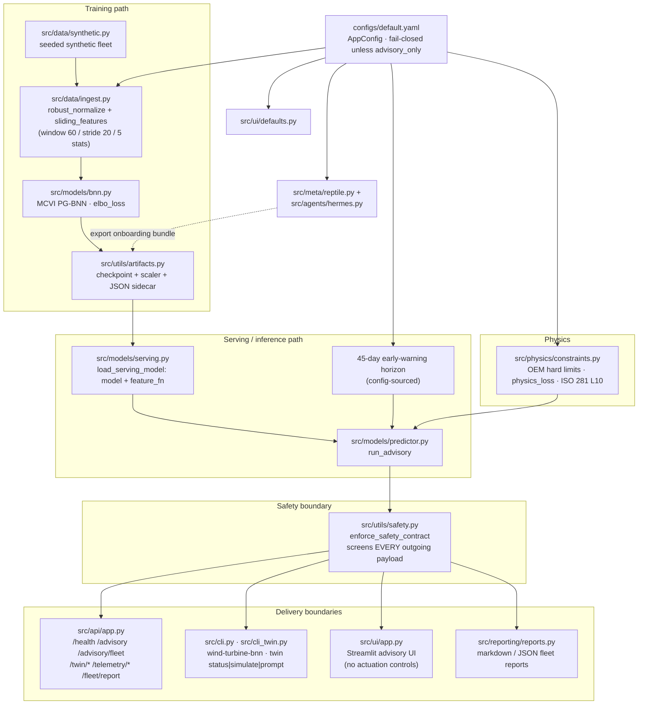
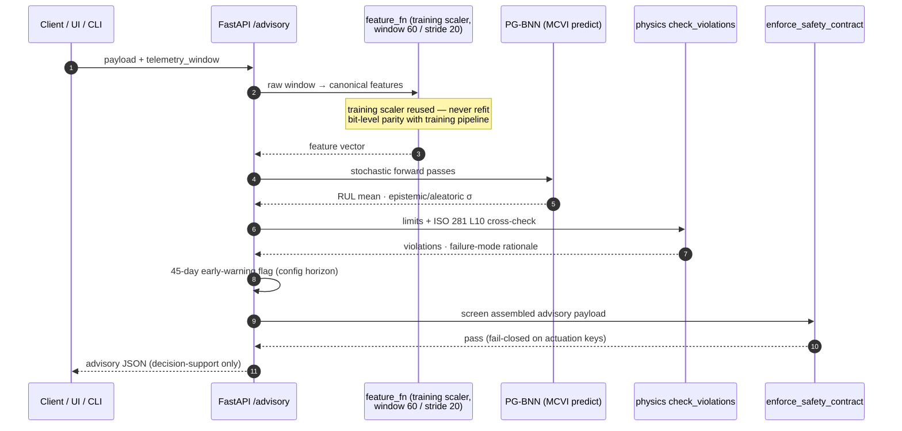
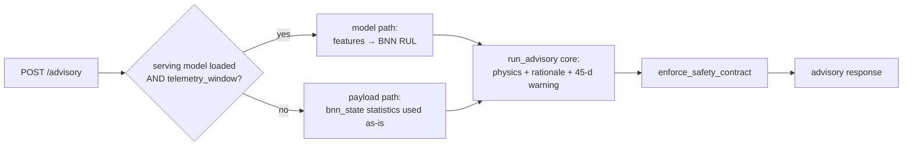
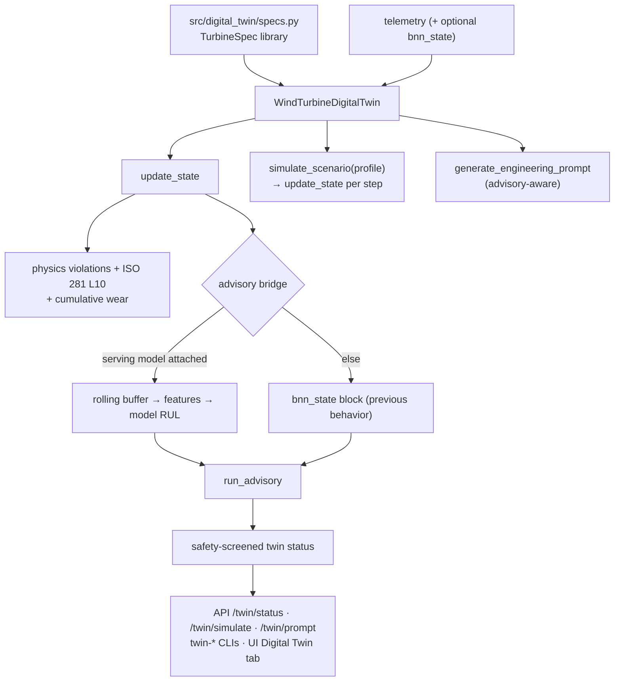
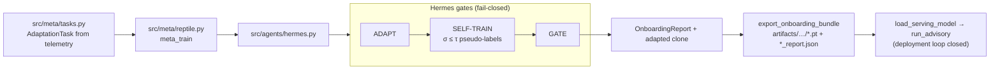
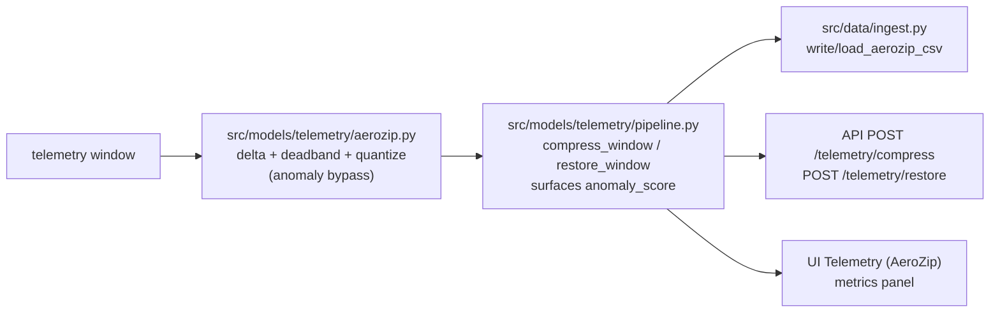

# AeroVigil diagrams — architecture & inference

Rendered [Mermaid](https://mermaid.js.org/) companions to the ASCII maps in
[`ARCHITECTURE.md`](ARCHITECTURE.md). GitHub renders these inline.

AeroVigil v1.0.0 · **advisory / decision-support only**

---

## System architecture

## Inference pipeline — model-serving advisory

`POST /advisory` with a `telemetry_window` while a serving bundle is loaded:

## Inference fallback — payload-based advisory (backward compatible)

`POST /advisory` with a `bnn_state` block is byte-for-byte the pre-integration
behavior; the model path activates only when a serving model is loaded **and**
the request carries a `telemetry_window`.

## Digital twin loop

## Meta-learning / Hermes onboarding

## AeroZip telemetry path

---

## Safety invariants shown by every diagram

1. **Advisory-only, fail closed.** Every payload crossing a boundary
   (`predictor → API/CLI/UI/report`) passes `enforce_safety_contract`; keys
   matching throttle/torque/pitch/rpm-setpoint/breaker/LOTO/part-number/
   actuation are rejected before leaving the system.
2. **Config gate.** `load_config` refuses anything that is not
   `safety.mode: advisory_only` with `allow_actuation: false`.
3. **Determinism.** Serving features use the training scaler (never refit) and
   the canonical window/stride/stat order.
4. **No arbitrary pickles.** Bundle metadata loads with
   `torch.load(weights_only=True)`.
